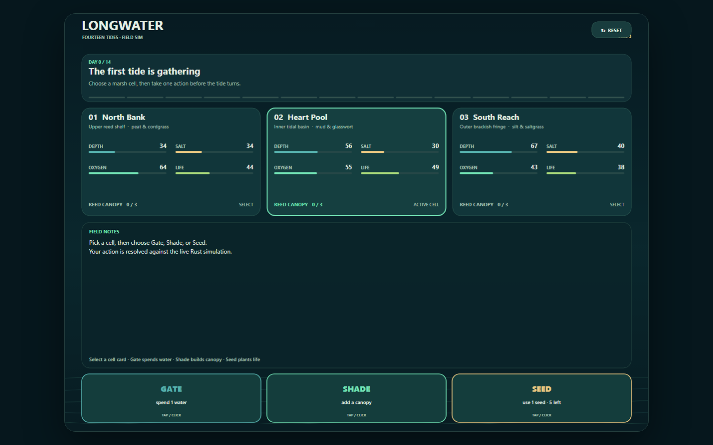
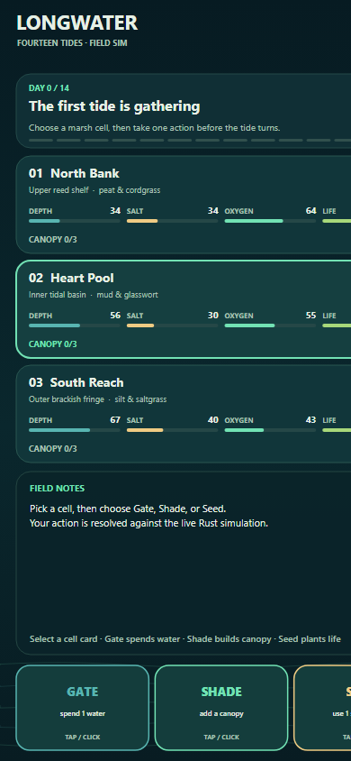

# Longwater: Fourteen Tides

A fourteen-tide marsh stewardship game. Keep the Longwater alive through the
changing tides.

**Play it live:** http://jacobmetoyer.com/longwater-browser-demo/

## The game

You steward a marsh through 14 tides. Three marsh cells sit under your watch,
each with live **Depth**, **Salt**, **Oxygen**, and **Life** readings plus a
reed canopy (Shade 0–3). Each tide, pick a cell and take one action:

- **Gate** — spend 1 water to flush the cell
- **Shade** — raise the reed canopy (max 3)
- **Seed** — spend 1 seed pack to plant life

Every action is resolved against the live Rust simulation compiled to
WebAssembly. Survive all fourteen tides to close the watch.

## Optional sound

Switch **Sound cues** on below the marsh to hear quiet, original synthesized tones. Gate falls like a ripple, Shade uses a low pair of notes, and Seed rises in three short notes. A closing chord marks the actual end of the fourteen-tide watch. Sound adds feedback to the existing reports; it does not change the simulation or saved progress.

Each page opens silently. The switch gives a short confirmation tone when sound is ready. Switching it off, hiding the page, or leaving the page stops sound and releases its audio context; returning stays silent until you enable it again. Unsupported or blocked audio leaves the game playable and displays an unavailable message. Interrupted audio can be enabled again with the switch. All tones are generated locally and included in the offline game, with no audio files, external requests or new dependency.


## Controls

- **Mouse / touch** — tap a cell card to select it, tap an action button to act,
  tap the reset button (top right) to start a new watch
- **Keyboard** — `Tab` moves between the reset, cell, and action buttons;
  `Enter` or `Space` activates the focused control. With a game control focused,
  `1` `2` `3` select a cell, `←` `→` move selection, `G` gates, `H` shades,
  `S` seeds, and `R` resets. Browser modifier chords and held-key repeats do
  not trigger game shortcuts.
- **Screen-reader access** — native buttons expose selection, action availability,
  and each cell's depth, salt, oxygen, life, and canopy readings. The Field notes
  region contains the complete tide report. The status region announces the
  selected cell and action results. An unavailable action stays focusable so
  its reason can be read, and never spends a tide.

The interface is responsive (compact stacked layout under 680px), supports
HiDPI canvases, and gives focused controls a visible outline. Short phone
screens scroll vertically so the field notes and action row remain separate.

## Review your watch

Open **Watch journal** below the marsh to revisit any completed tide. Each entry
keeps the action and cell accepted by the simulation, the tide event, the complete
field notes and all three cells' readings before and after that tide. These net
changes include the action, the tide and dawn drift; the full notes explain each
part. Selecting a cell or attempting an unavailable action adds no entry.

After the fourteenth tide, the journal opens with the simulation's outcome and a
comparison of the opening and final readings. Earlier tides remain expandable so
you can trace how the watch developed. Tab and Enter operate the journal, and
game shortcuts run only when a game control is focused.

Your saved tides return with the watch when you reload or come back later. The
journal restores the complete reports and the original opening readings, so its
final comparison still covers all fourteen tides. Reset starts a fresh journal.

### Compare the marsh readings

**Watch trends**, inside the journal, plots the three cells together for one
reading at a time: Depth (cm), Salt (ppt), Oxygen (%), Life (%), or Canopy (/ 3).
The lines begin with the actual opening readings and extend only through tides
you have completed. Their changes include your action, the tide and dawn drift;
they do not isolate the effect of an action or predict a future tide.

Choose a reading, then click the chart or move **Review tide** to inspect that
opening or tide. The readout shows each cell's exact value and the accepted
action and event. The slider works with the arrow keys, Home and End. Different
line patterns distinguish the cells as well as color. **All readings for this
metric** opens a complete table, including the opening and every completed tide.

The view follows new tides while you are reviewing the latest one. If you choose
an earlier tide, it keeps that selection during further play. Reviewing changes
neither your selected game cell nor the simulation or saved watch. Reset clears
the graph to the native opening, and resume rebuilds it from the same verified
native replay as the journal. The direct-open packaged game includes this view.

## Resume your watch

The watch saves in this browser after a successful tide or a change of selected
cell. Return to the same site in the same browser to resume the saved day, cell
and full journal. No account or server is involved; the saved history contains
only game actions and the resulting local simulation state.

The progress message below the marsh shows whether the latest watch was saved.
If saving fails, keep the page open and use **Try saving again**. An unreadable
save or a save changed by another tab is kept while this page can continue
without saving. **Reset** starts a new watch and replaces the saved one. It also
clears the current journal.

## Screenshots




## Play offline

Use **Download offline game** below the marsh on the
[live game page](https://jacobmetoyer.com/longwater-browser-demo/). Save the HTML
file, then open that downloaded file to play without a server or internet
connection. It starts a separate watch; your existing online watch stays in
that browser's site storage.

The file includes the complete simulation, controls, saved-watch module and
journal. When its save message confirms success, reopen the same file in the
same browser to resume. File storage follows browser policy, so keep the game
open and use **Try saving again** if it reports that progress was not saved.

## Run locally

With Node installed, serve the source directory:

```sh
npm start
# open http://localhost:8000/
```

Any static server that serves `.wasm` with `application/wasm` also works. The
source `index.html` needs a server because it loads separate ES modules.

For a portable review copy, build a single file:

```sh
npm run package
# open dist/Longwater-Fourteen-Tides.html directly in a browser
```

The generated HTML embeds the same interface, journal, saved-watch module,
styles and WASM bytes. It needs no server, internet connection, npm packages or
installation to play. Packaging itself uses only Node's built-in modules and
prints the artifact and source SHA-256 checksums. Identical runtime inputs
generate identical bytes.

The website's download is committed at
`downloads/Longwater-Fourteen-Tides.html` so the existing branch-based Pages
deployment serves it alongside the game. After changing any runtime input,
regenerate that published copy with the same packager:

```sh
npm run package -- downloads/Longwater-Fourteen-Tides.html
```

The actual-download browser check compares the downloaded bytes with a fresh
build before opening them offline. A stale published copy fails `npm test`.
The packager replaces the online download panel with an offline-copy note;
the saved game does not retain a link to a missing neighbouring artifact.

Reopening the same file in the same browser restores the saved watch and full
journal when local-file storage is available. The visible progress message
reports whether saving succeeded; keep the page open if it says the watch
could not be saved. Reset also replaces the saved offline watch.

## How it's built

- `index.html` / `style.css` — shell, layout, responsive rules
- `game.js` — canvas UI: rendering, layout, input, screen-reader announcements
- `journal.js` / `journal.css` — visible tide history and end-of-watch review,
  using the actual before/after WASM snapshots and reports
- `watch-trends.js` / `watch-trends.css` — one-metric, three-cell trend chart,
  keyboard tide readout and complete numeric table from those journal snapshots
- `watch-save.js` / `watch-save.css` — bounded local action history and visible
  save status; the unchanged WASM validates saved state and rebuilds all journal
  snapshots when the watch resumes
- `pkg/` — prebuilt WebAssembly simulation plus its `wasm-bindgen` JS glue
  (`longwater_web.js`, `longwater_web.d.ts`) and the `.wasm` binary. The
  canvas talks to the sim through `BrowserSession`
  (`snapshot_json` / `take_turn` / `restart`).
- `screenshots/` — desktop and phone captures
- `.nojekyll` — GitHub Pages serves the site as-is from this branch
- `scripts/package.mjs` — deterministic single-file offline distribution

## Verify

```sh
npm ci
npx playwright install chromium
npm test
```

The browser tests require Playwright's Chromium or an existing Chromium executable
selected with `LONGWATER_CHROME_PATH`. They play the actual bundled WebAssembly
simulation. Journal acceptance compares its displayed reports and readings with
a separate native WASM session, completes all fourteen tides, checks reset and
unavailable actions, and captures desktop/phone views in `test-results/`.
Composition tests cover a resumed partial/completed watch, the original final
recap, failed-save retry, a corrupted native snapshot and two tabs with different
progress. The save admission check does not create a transaction between
simultaneous writes in different tabs.

The offline packaging case opens the single HTML through `file://` with
networking disabled, plays a real tide, closes and reopens the page, compares
the complete restored journal and readings, resets the saved watch, and
requires all assets to be embedded. It also verifies byte-identical builds.

Browser qualification covers desktop Chrome and Chrome's touch emulation;
physical-device and actual screen-reader acceptance remain separate.

### Journal integration

`WatchJournal.start(state)` accepts the day-zero native snapshot;
`record(before, after)` adds the next successful native tide. On startup,
`SavedWatch.replayHistory()` replays the already accepted action history in a
separate native session and verifies its final snapshot against the active
watch. It returns the opening `snapshot_json()` string followed by every
successful `take_turn()` string, without changing the active watch or storage.
`WatchJournal.restore(snapshots)` checks that the full sequence is in order before
rebuilding the display. Its sequence checks do not authenticate arbitrary stored
snapshots; the save module must admit the native replay first. A resumed state
alone cannot become the journal's opening. `setLifetime(message)` supplies the
visible notice about this integration's persistence behavior.

## License

No license file is present yet.
