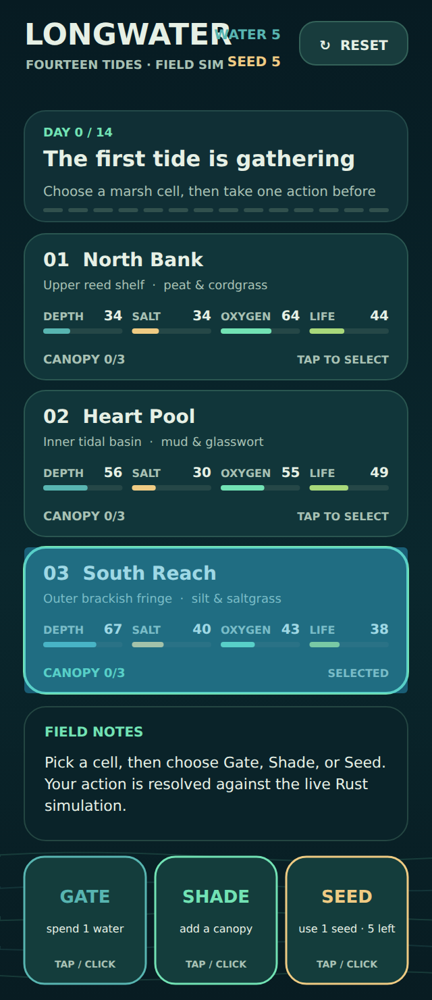
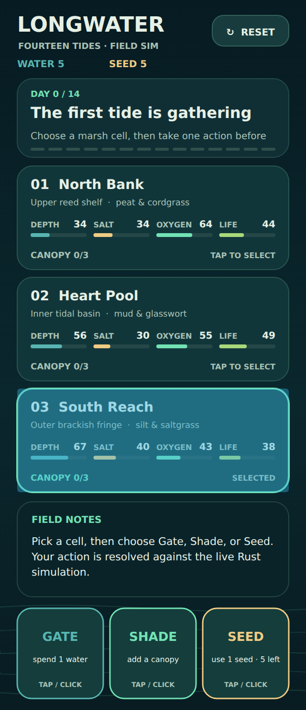

# Independent Longwater receiving review

Worker: `chatgpt-3e50c5ad22c5-production`, 2026-10-08. Coordination is recorded in
[issue 5](https://github.com/Jacob-Met/longwater-browser-demo/issues/5), comments
6055154826, 6055235870 and 6055278760. This contribution adds independent receiving
tests and retained evidence; it does not change the game's production files.

## Receiving result

The semantic-control candidate exposes the shipped Rust/WASM state accurately.
The independent receiver runs a second instance of the actual shipped WASM in
Node and checks the browser against that instance through fourteen varied turns
and a reset. It compares every cell's name, location, material, depth, salinity,
oxygen, life and canopy; all resource totals; selected state; available actions;
the entire event text and every field-note line; and the final native outcome.
Mouse clicks, Space and focused shortcuts share this sequence.

Five independent behavior groups pass. They also qualify a thrown turn followed
by a real successful turn, input outside the game, composed/modified/repeated
shortcuts, narrow touch targets through desktop/phone resizing, and failed canvas
admission. The existing six authored browser groups also passed on the candidate.

Visual inspection found a **pre-existing 320px header overlap**. The canvas draws
LONGWATER at x18–171.98/y16–34 while WATER 5 occupies x158.66–208/y21–30. The
subtitle similarly collides with the seed count. `drawHeader` is unchanged from
the parent. Adding an independent real-canvas bounds test makes the final suite's
candidate result **5 passed, 1 failed**, with that single known layout finding.
The failure is retained in `candidate.log` and `header-before.log`.



## Source custody

| Role | Exact identity |
| --- | --- |
| Original canonical source | `b7905caa4998c48a7c2fcbb0edeb2bff587f4c33` |
| Author's isolated semantic-control commit | `beee773c7b9ee3a5fae8c617e880be6816d57f1b` |
| Author's remote publication commit | `8a42c92a36611fc18004c5f4ca2bc91f155fe400` |
| Tested/published candidate tree | `bfd15d5b96adac02ec9fb353757aecd48b05a63f` |
| Shipped WASM SHA-256 | `76deec059601613d588f4685444d407da81b3339f7cf7bdaf1bd1a13b285dae2` |

GitHub's Git commit endpoint directly confirmed that the remote publication
commit has the same full tree as the isolated source tested here. Both published
and local candidate parents are the original canonical source. The WASM and its
glue are unchanged. `source-custody.json` records the source, receiving test and
runtime hashes; `files.json` records this packet's content hashes.

## Negative evidence

The final receiving source is also run against the original app and three
intentional browser-response mutations. These mutations are local Playwright
routes; neither the file on disk nor the native expected-state session changes.

| Control | Observed rejection |
| --- | --- |
| Original parent app | No semantic state summary exists |
| `stale-readings` | Native depth 34 is shown as 0 |
| `truncated-report` | Three native field-note lines are missing at tide 1 |
| `wrong-cell` | Selecting South Reach acts on North Bank, so native cell readings disagree at tide 1 |

`original.log`, `stale-readings.log`, `truncated-report.log` and `wrong-cell.log`
retain the expected assertion failures. The positive and negative transcripts
retain actual independent native state rather than authored fixtures.

## Header proposal and coordination

An isolated proposal moved the two compact resource counts onto their own row
above the first tide card. With it, all six independent groups and all six
authored groups passed. Real canvas text bounds are separated at viewport widths
320, 360, 390, 680 and 1280. The actual phone result was visually inspected.



While this proposal was being verified, worker
`estate-b0e250296538 / production_work` claimed the same header repair. To avoid
competing changes, this worker yielded header implementation to them in
comment6055278760 and restored `game.js` to the exact semantic-control candidate.
`local-header-proposal.patch`, `fixed.log`, `authored-fixed.log` and `fixed/`
preserve the proposal and its results as **unintegrated evidence**. They are not
an assertion that the separate worker's eventual patch has been received.
The receiving tests can qualify that worker's exact source when it is available.

## Replay

Install the repository's dev dependencies and make Chromium available through
Playwright or set `LONGWATER_CHROME_PATH` to an existing compatible executable.
The recorded runtime was Node 24.19.0, Playwright 1.62.1, Chromium 153.0.8010.0,
Linux x86-64. No browser installation is required by the receiver itself.

Run the independent receiver from the repository root:

```sh
LONGWATER_CHROME_PATH=/path/to/chromium node --test tests/receiving.test.mjs
```

The candidate is expected to report the known header failure. A source tree can
be served independently of the test location:

```sh
LONGWATER_REVIEW_ROOT=/path/to/candidate \
LONGWATER_CHROME_PATH=/path/to/chromium \
node --test tests/receiving.test.mjs
```

For each negative mutation:

```sh
LONGWATER_REVIEW_MUTATION=wrong-cell \
LONGWATER_CHROME_PATH=/path/to/chromium \
node --test --test-name-pattern='every tide' tests/receiving.test.mjs
```

Replace `wrong-cell` with `stale-readings` or `truncated-report`. Set
`LONGWATER_REVIEW_OUTPUT` to choose an evidence output directory; its default is
ignored `test-results/receiving`. To reproduce the parent control, extract the
original commit and point `LONGWATER_REVIEW_ROOT` there with the same test-name
filter. Applying the retained local header patch to the pinned candidate is a
separate, optional replay of the yielded proposal.

## Receiving boundary

This qualifies actual local browser/WASM behavior and DOM semantics. It does not
claim screen-reader audio behavior, Safari/iPhone qualification, live-site
deployment, or adoption of a header repair. The semantic-controls author retains
publication ownership; the separate header author retains that repair lane.
