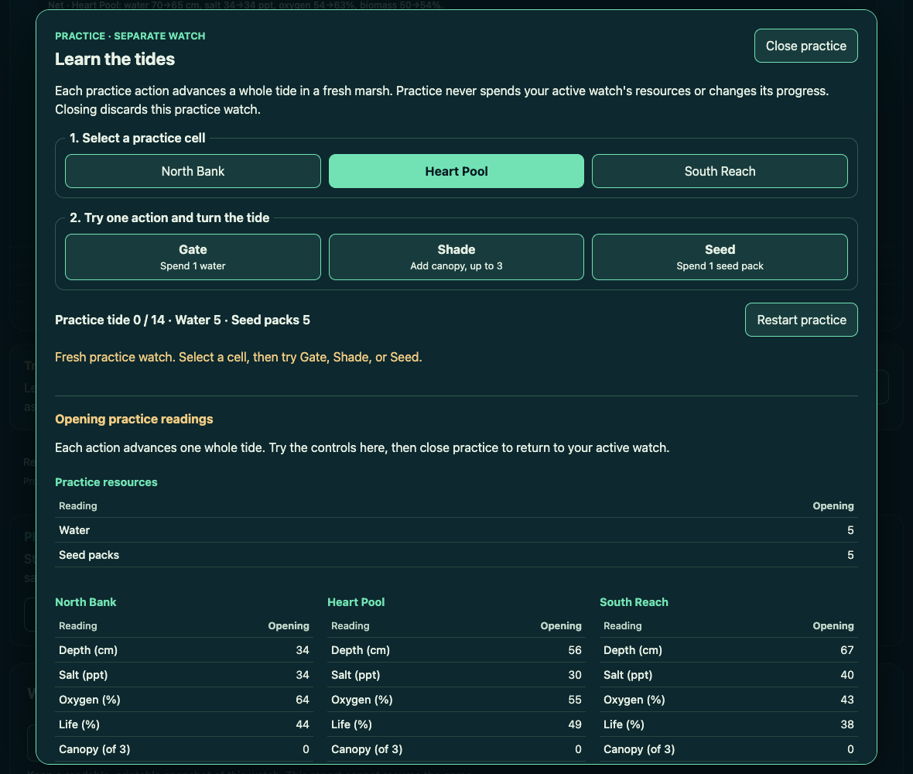
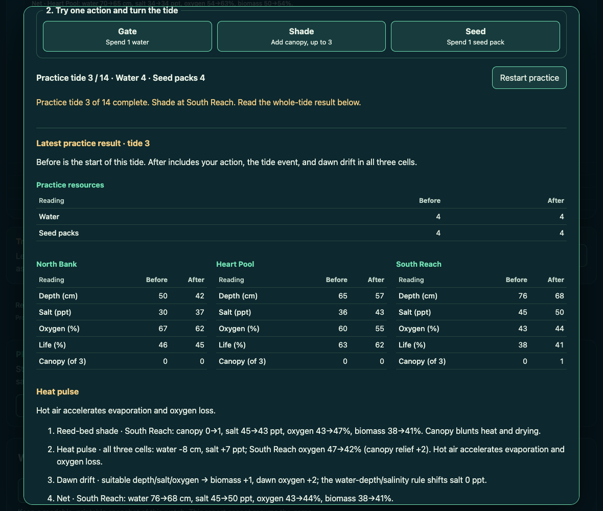
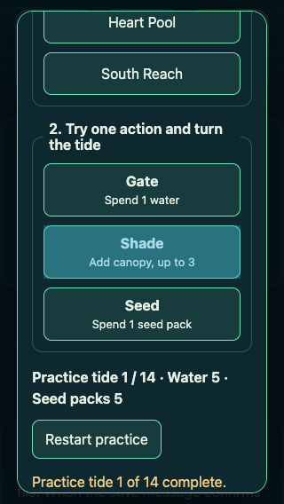

# Longwater practice watch: initial native receiving

This packet qualifies the first practice-watch contribution on canonical
Longwater source `e4e9bf82f6ebb363896559507a2fb5af07b490f5`.
The player can try the real Gate, Shade, and Seed controls in an independent
practice watch, read the whole tide's consequences, and return to the active
watch with its state and saved progress intact.

The source implementation and generated offline game are identified in
[source-manifest.json](source-manifest.json). The packet is frozen for that
starting source. The subsequently landed portable-watch work at `43038d28`
requires a separate composed source and regenerated offline artifact.

## Player-visible result

**Open practice** opens a new fourteen-tide session at tide zero with Heart
Pool selected. North Bank, Heart Pool, and South Reach have separate selection
buttons. An accepted Gate, Shade, or Seed action advances the practice session
through exactly one real tide.

Opening tables show water, seed packs, and all five readings for every cell.
After an accepted action they show the before and after values for all three
cells, followed by the complete event name, event note, and every field-note
line. The interface attributes these changes to the action, tide event, and
dawn drift together. It does not present an action-only effect or predict the
next tide of the active watch.

Unavailable actions retain the accepted practice readings and show the actual
simulation's refusal. **Restart practice** starts a new owned session.
**Close practice** and Escape discard practice and return focus to
**Open practice**. The same controls are embedded in the single-file offline
game. The temporary practice state is never serialized.

## Source and receiving identity

| Item | Exact identity |
| --- | --- |
| Canonical starting commit | `e4e9bf82f6ebb363896559507a2fb5af07b490f5` |
| Canonical starting tree | `1e07b279db3634a42e2ef5e7b72656529a2223c0` |
| Practice controller SHA-256 | `31c3839022c89aa86c761087aeb1788c2ae9315d8e297b8a2d34cda956b63b18` |
| Practice stylesheet SHA-256 | `44152eef4e21a6a0198e8994060ba9b5dc4cbb6d882f037897595c75c6927d29` |
| Maintained practice receiver SHA-256 | `91ba360b8c0a17b1d73d81635ad7a6d4cfcf1fb0a570c0326381185d1f151038` |
| Unchanged shipped WASM SHA-256 | `76deec059601613d588f4685444d407da81b3339f7cf7bdaf1bd1a13b285dae2` |
| Offline HTML SHA-256 | `f5e85fac42e3356881baba68baaf0cba83cc12d90f339e6abd8ebcd76af6dafd` |
| Offline HTML size | 284,732 bytes |
| Packager runtime-input SHA-256 | `840ac9b35f573f70a80f06534d956b31ff7209b25efb7e00e52ebe84f553bb4f` |

The existing offline-download receiver records a Git HEAD. The first native
directory was a verified, isolated runtime/test subset without Git metadata.
Its later local-only commit `9a91fbe76c63e0c63b88aeb677198961e05021ea`
(tree `bc2c19c7ba9face58c48eec4d1fae89b38f2d69a`) truthfully records
those 37 tracked files. It is distinct from the complete canonical repository
and was never pushed as a source branch. The local setup, identity, tracked
paths and commands are retained in [partial-git-snapshot.json](partial-git-snapshot.json).

## Actual native outcomes

The actual environment was Node 26.3.0, Chrome 154.0.8037.98 and Playwright
1.62.1 on the existing Mac receiving host. The unchanged 71,368-byte WASM
executed directly; no Rust/WASM compilation or dependency installation was
needed. Playwright resolved through existing estate dependency artifacts,
used read-only, with browser profiles and output in the new owned receiving
directory. [Runtime/package provenance](baseline-runtime.json) records the
resolved paths, versions and hashes.

- The original page started with seven live game controls and no practice
  entry or dialog. [Observed baseline](baseline-ui.json).
- Separate direct WASM sessions produced real, distinct first-tide Gate,
  Shade, and Seed results while an independent untouched session retained its
  exact opening snapshot. [Full baseline samples](baseline-wasm.json).
- Direct native refusal probes retained state after exhausted water, full
  canopy, exhausted seed packs and a completed fourteen-tide watch.
  [Native limits](baseline-constraints.json).
- Five JavaScript syntax checks and all six new maintained browser/WASM cases
  passed. [Author receiving](author-cut1/receiving.json) and
  [actual test output](author-cut1/07.stdout.txt).
- The original whole-project run passed 63 of 72 cases.
  [Original full outcome](full-cut1/receiving.json) and
  [complete original log](full-cut1/stdout.txt) retain all nine failures.
- After the two bounded fixture/environment corrections described below,
  all nine affected cases passed in 8.3 seconds.
  [Affected-file rerun](repaired-fixtures/receiving.json) and
  [actual rerun log](repaired-fixtures/stdout.txt).

All 72 cases are qualified across the original 63 passes and the nine-case
rerun. This packet does not claim a single successful native 72-case run.
The product controller, CSS, HTML, game hook and packager bytes stayed
unchanged throughout those runs.

### Six maintained practice cases

1. Pointer interaction in all three cells with Gate, Seed and Shade, comparing
   resources, every reading in all three cells, and complete reports against
   independently created actual-WASM sessions. A resumed two-tide active
   watch, selection, journal and saved bytes remain exact throughout practice.
2. Tab, Enter and Space control selection and actions. Native water/canopy/seed
   refusals preserve the latest accepted result. The same sequence reaches
   the real fourteen-tide outcome; practice keyboard input does not trigger
   background Reset/R.
3. Restart, close and an immediate close/reopen sequence exercise actual native
   session destruction. An old queued close event cannot free the new practice
   session.
4. Practice remains usable when browser storage is blocked. A refused modal
   opening preserves the active watch and allows a later successful open.
5. Real touch interaction at 320 pixels preserves the watch, keeps controls
   at least 44 pixels in each dimension and produces no horizontal clipping.
6. Two packages from identical inputs are byte-identical. The offline file
   runs practice with no network or neighbouring assets, preserves its active
   watch, and opens a fresh practice session after the same file is reopened.

The inherited download receiver additionally activated the real download
link with Enter, checked that the downloaded bytes equal the fresh package,
played that actual file offline and resumed its saved journal. Its detailed
[delivery receipt](actual-download/receipt.json) is retained.

## Preserved failures and bounded corrections

The first inherited whole-project run exposed two specific receiving seams:

- The existing save-browser test serves an explicit MIME map. It returned
  404 for the newly imported practice controller, so eight tests never reached
  their save assertions. Exactly two rows now serve the practice JS and CSS.
  The original save assertions remain intact.
- The existing download receiver invokes `git rev-parse HEAD`.
  The verified partial native directory initially had no Git metadata.
  It received the truthful local-only identity described above, after which
  the unchanged download test passed.

The existing failed-WASM-startup assertion also now names the two relevant
boundaries explicitly: all seven live game controls remain disabled, and
**Open practice** remains unavailable. This preserves the original failure
contract as the page gains a new entry button.

The original primary ENOSPC outcome and first dependency-metadata path error
are recorded separately in [environment-outcomes.json](environment-outcomes.json).
They are not characterized as simulation or product failures.

## Visual receiving

These are actual native browser captures from the unchanged qualified
controller and CSS. Root visually reviewed the opening, whole-tide result and
320-pixel touch layout.

## Independent receiving and ownership

A separate reviewer accepted the source isolation and authored an independent
three-case browser receiver. Its frozen final receipt is
`bbc321b980e6fce45557220c1e72413d6b538204a96b3861ac2d1087a383bf02`
and is published in a separate review packet.

That receiver showed zero practice storage writes, exact resumed-watch and
saved-byte preservation, and a subsequent live Shade snapshot byte-identical
to a separate live-only native control. It also received failed-restart
retention, correct native session release and actual pagehide. Its original
Chrome focus/console-telemetry assertions and their diagnostic corrections are
retained in that independent packet. No product change was required.

Scope authority is [project issue 24](https://github.com/Jacob-Met/longwater-browser-demo/issues/24).
The save/replay owner, portable-watch owner, sound owner and historical-choice
owner retain their existing implementations. The practice controller receives
only an initialized session factory and its own dialog elements; it has no
access to SavedWatch, localStorage, live selection, journal or history.
