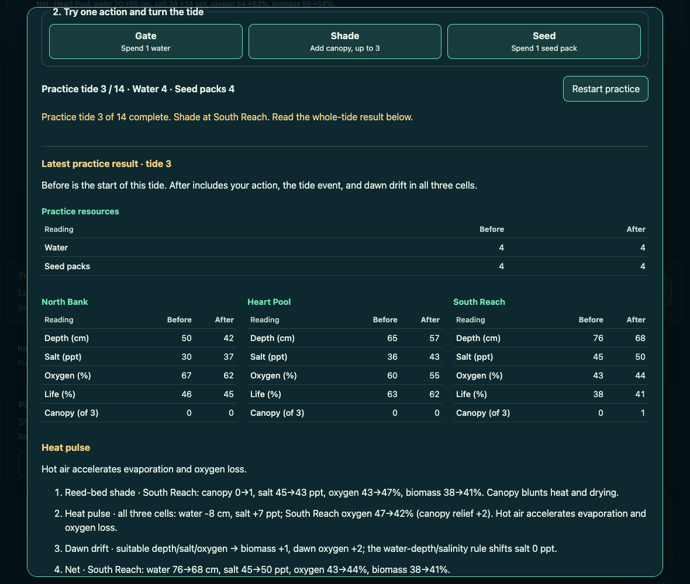

# Longwater practice watch: current transfer composition

This packet qualifies the practice watch composed with the portable watch-file
feature on canonical Longwater commit
`43038d28b08562a5f1c143b2773d925b4d28ca7d`, tree
`aaffb920e4a3a0065756c234cdeb0a8a1631f1a2`.

**All 98 current project tests passed on the first current-suite attempt.**
The run exited successfully in 67.029 seconds with no failed, cancelled,
skipped, or todo cases and empty stderr. All 43 pinned source, runtime, test,
documentation, and offline-output files were byte-identical before and after
the run. The complete result is in
[full-current/receiving.json](full-current/receiving.json) and
[full-current/stdout.txt](full-current/stdout.txt).

## Source and receiving boundary

The parent composed eight exact source paths in draft tree
`e75108b71639c83ba3783af4fa637b4af493794a`. The draft still contained the
target's previous offline HTML. This receiving regenerated that artifact from
the combined source; its replacement Git blob is
`5261ca1d5964758b62f9c0c7805e7a2b5aa3db8d`, 303,370 bytes, SHA-256
`482f25f25958f39a53f9da009d19b3acbdafc9bf80a5807a5c70691d9902002e`.

[The source cut](source-cut.json) pins every staged file and the five syntax
checks, exact package inputs, read-only dependency identities, and local
snapshot metadata. The unchanged current browser test is Git blob
`c1c1c85a404fad4d8894534187a884a6ded4de9f`; the historical practice-specific
change to that file was dropped because the current test already checks the
disabled startup controls. The save-browser fixture receives only the two
practice asset MIME entries. Existing transfer, save, journal, report, trends,
reset, and simulation implementations remain canonical.

The local commit `fd2424412f5b9665984e72934a5d092648f00691`, tree
`7cf9d64a3b86d20ece85a1677dcb55af479fba37`, identifies this partial runtime
and test snapshot for the existing actual-download receiver. It is local
receiving metadata, with no configured remote. It does not identify the full
canonical repository or its integration history.

The source consumes the existing shipped WebAssembly simulation, Git blob
`faf26b8aa6a8887688249d6e3e34b3042c8babf3`, SHA-256
`76deec059601613d588f4685444d407da81b3339f7cf7bdaf1bd1a13b285dae2`.
There was no native build, package installation, or WASM regeneration.

## Player-visible result

**Open practice** creates an independent fresh watch. The player selects one
of the three marsh cells, then uses Gate, Shade, or Seed to advance a real
tide. The result displays resource changes, all five readings for every cell,
the complete tide event, and every native report line. **Restart practice**
creates a fresh practice session; **Close practice** or Escape discards it and
returns focus to the entry. Active-watch state and saved progress remain
independent throughout.

The current result frame shows practice tide three after Shade at South
Reach. Its before and after table includes the whole tide. For example,
South Reach salt changes from 45 to 50: the action first reduces it to 43,
then the heat event adds seven. The complete native explanation remains
visible below the table, so an action-only effect is not confused with the
final result.

The unchanged six authored practice cases are included in the 98-case
current suite. They exercise actual WASM pointer and keyboard actions,
resource refusals and the final fourteenth tide, separate native session
lifetimes, blocked storage, modal-open refusal, touch controls at 320 pixels,
and the deterministic offline file. The current suite also receives the
portable-watch native admission and browser controls, transferred journal,
report and trends, saved-watch protection, reset review, and real downloadable
offline delivery.

## Offline delivery and independent composition review

[The packager receipt](package.json) records runtime-input SHA-256
`b0bd9b7df466b9a673708526f2925dfa1d00e5d6eeb30d90148ab0ad987f7cef`.
[The actual-download receipt](actual-download/receipt.json) comes from the
maintained browser case that downloads the offered file, compares it with
fresh packaging and the published-path bytes, then opens and resumes it
offline. Its source identity is the explicitly local partial snapshot above.

A separate independent receiver ran one new interaction on this exact
composition. It held a real watch file's asynchronous text read, opened and
advanced practice, then released the file bytes. The arriving nonmodal
preview retained focus inside practice and changed neither watch nor saved
bytes. Closing practice preserved the preview; explicit Replace imported the
record once. Reopening fresh practice left the imported watch intact, and
the next live tide matched a separate native control. All 25 independently
checked files remained unchanged and no page error occurred. That packet is
separately identified by manifest Git blob
`da61ce881022c5baaa12d70da2cbe5de3fac74f6`; its receiver and oracle are
independent of this full-project runner.

## Execution and retained environmental outcomes

[The exact runner](run-full-current.py) invokes the current project's complete
`tests/*.test.mjs` set through Node's test runner, with test-file concurrency
one to bound simultaneous browser storage. Each case is unchanged. It uses
the existing Mac Node and Chrome executables and read-only Playwright 1.62.1.
[Runtime metadata](runtime.json) records the resolved executable versions and
package identities. All temporary execution belongs to the new
`hamon-longwater-practice-43038-71826f7aa69e` root.

The first staging attempt hit `ENOSPC` while copying the unchanged WASM
file. A read-only capacity check subsequently showed free space, and the
missing unchanged batches were retried with exact Git-hash verification.
No files were deleted. A metadata precondition also initially assumed a
flat playwright-core path; resolving it beside the actual Playwright package
corrected that check before source execution. Both original errors remain
in `source-cut.json`.

The earlier native packet on `e4e9bf82` remains frozen. Its original
63-of-72 result and the focused nine-case fixture rerun retain their original
source context. This packet's 98-of-98 current result is a separate run
against the portable-watch composition. No initial source, evidence,
borrowed dependency, or peer workspace was changed.
