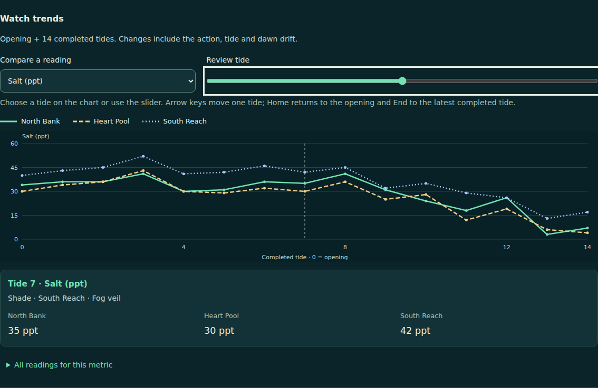
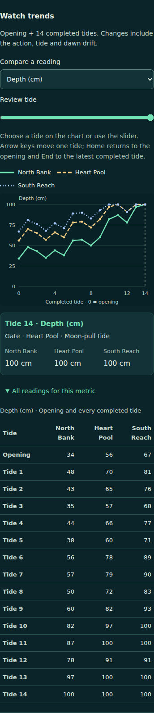

# Watch trends: source and receiving

This contribution adds a read-only way to compare the three Longwater marsh cells across the opening and completed tides. A player selects one metric and its native unit, reviews any completed tide by keyboard or pointer, and can open the complete numeric table for that metric. The chart uses the same admitted native snapshots as the existing journal.

## Source identity and ownership

- Repository: `Jacob-Met/longwater-browser-demo`, target branch `longwater-demo`.
- Ownership: [issue #10](https://github.com/Jacob-Met/longwater-browser-demo/issues/10), contributor `afe225d6c6be / engine_execution`.
- Actual receiving base: `b4c3b82e61c654d27c592c17ee161fd404602150`.
- Actual base tree: `5123f432300382718e4fc7294deddf6d30acd0a5`.
- Frozen source tree, before these additive qualification documents: `d17b78954373f1ffff0ad465deba799c372ae521`.
- Eight changed source/test/document paths; every other one of the 43 base leaves retains its exact Git blob and mode. The two inherited screenshot modes remain executable, as recorded upstream.
- The standalone patch is 35,062 bytes, SHA-256 `a06c50618300685e29f857cf8951c0aca265d41c7d41e65b3a90561df017c23a`. A separate temporary receiver applied it and reproduced all eight frozen file hashes.

[Source freeze](source-freeze.json) gives each old/new blob and final SHA-256. [Base pins](base-pins.json) and [base modes](base-modes.json) identify the complete 48-file upstream tree. This work was materialized from verified blobs, without synthetic upstream commit history. Qualification documents are additional evidence and do not change the recorded executed-source pins.

The new `WatchTrends` module receives only `start(state)` and `record(before, after)` from narrow hooks in `journal.js`. The existing journal performs its ordered native-replay checks before replacement. Game actions, selected-cell behavior, save format, storage, WASM/glue and the original reports remain intact. The packaged page embeds the nested trend module and its stylesheet with the existing deterministic builder.

## Contract and amendments

The [original pre-candidate contract](contract.md) is unchanged: SHA-256 `68019f69f33962f020c517dd9ada093ef2da7c5d90dcaa7ca56e8d5f3d9085f7`.

Two discovered composition requirements were separately approved and recorded:

1. [Stylesheet addendum](stylesheet-addendum.md): the existing packager requires an explicit stylesheet href. Exactly one link was added to `index.html`; all other index markup is preserved.
2. [Test fixture addendum](test-fixture-addendum.md): the inherited save-browser fixture serves a literal asset map. Exactly two entries were added for the new JS/CSS assets; every inherited assertion is unchanged.

## Executed qualification

| Receiving stage | Actual result |
| --- | --- |
| Exact base, inherited Node/WASM/browser suite | 40 passed, 0 failed |
| New capability control on exact base | Expected missing-view assertion; the old game and journal run normally |
| Initial seven new browser/WASM groups | 7 passed, 0 failed |
| First full composition | 18 passed before missing fixture assets caused startup timeouts; stopped at the recorded 120-second harness deadline |
| First real pointer capture | Correct tide selection, but pointer default focus displaced the slider; refused |
| Corrected full suite | 48 passed, 0 failed, 0 skipped |
| Corrected actual pointer/desktop/390px capture | Passed; exact native table, keyboard continuation, no external requests or page errors |
| Standalone packaging | Byte-identical repeat build; actual file page plays and reopens the same native saved readings offline |

The final [Node receipt](qualified/receipt.json) and [raw output](qualified/tests.log) bind the executed eight file hashes. Source remained unchanged during the full test run. The tests use Node v24.19.0, existing Playwright 1.62.1 and an isolated Chromium 153.0.8010.0 process. No browser installation or live site was used.

The eight new groups compare all five metrics and three cell series with a separate instance of the actual bundled WASM. They cover changed action/cell sequences, all opening/completed table rows, true plot direction, exact selected-tide readouts, unchanged journal/storage/native state during inspection, earlier-versus-latest selection, Tab/arrows/Home/End, rejected actions, reset, partial and fourteen-tide replay, invalid replay preservation, chart-pointer focus and direct-file parity.

The first pointer failure is retained in [its receipt](first-composition/pointer-r1-failure.json), and the earlier new module is preserved in [the original source](initial/watch-trends-before-pointer.js). The correction prevents the pointer event's default focus transfer before explicitly focusing the existing slider; a new actual-pointer regression is part of the 48-test successor. The original seven passing tests are not relabeled as having covered this later counterexample.

The first full-run [receipt](first-composition/receipt.json) and [log](first-composition/tests.log) preserve the real fixture failure. The old HTTP map omitted the newly imported assets, so the affected save-browser startup never became ready. Its two-entry correction qualifies the inherited assertions against the composed application.

## Reproduce

From the repository root, using the locked existing dependencies and a Chromium executable:

```sh
npm ci
LONGWATER_CHROME_PATH=/path/to/chromium node --test --test-concurrency=1 tests/*.test.mjs
npm run package
```

The regular test glob includes the new receiver. The browser and packager operate on disposable documents and temporary local saves. A temporary writable directory can be selected with `TMPDIR`. The retained capture driver records the actual local receiving paths; the portable behavioral receiver is `tests/watch-trends.test.mjs`.

## Final inspected views

The desktop shows Salt in ppt with Tide 7 selected; the phone shows Depth in cm with all fifteen opening/completed rows. Both use actual native outputs, not hand-authored chart values. The [capture receipt](qualified/capture-receipt.json) retains the action sequence, opening/final native states, pointer selections and image hashes.





Independent root receiving uses separately frozen native inputs and is recorded separately. Source qualification here does not assert source integration, a live Pages deployment, physical-phone acceptance or a scientific claim about the simulation.
